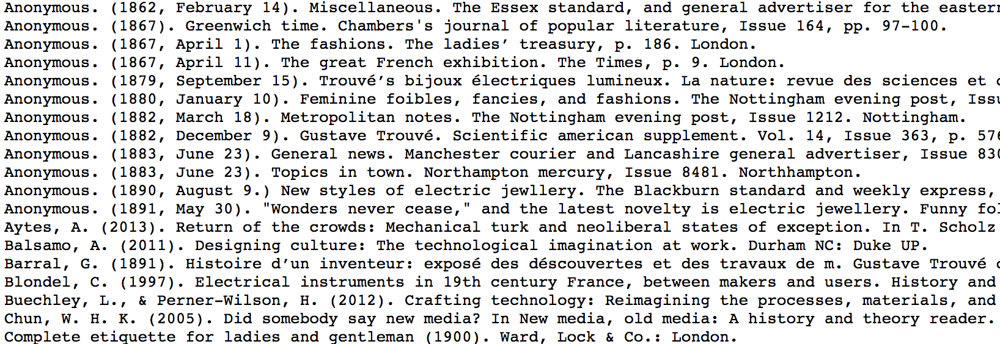

# Early Wearables Kit (2015) 

This repository contains files for the "Early Wearables Kit" made by the Maker Lab in the Humanities (MLab) at the University of Victoria (http://maker.uvic.ca/). The Wearables Kit prompts people to reverse engineer and reassemble an electro-mobile skull stick-pin intended for cravats, designed by Gustave Trouvé, built by Auguste-Germain Cadet-Picard, and exhibited at the *Exposition universelle* in Paris in 1867. Powered by a 1.5-volt zinc-carbon battery located in the wearer's pocket, the skull on the pin was said to snap its jaws and move its eyes. To activate the battery, the wearer would flip the pocket battery from a vertical to a horizontal position. Once activated, the battery would trigger a mechanism (resembling that of an [electric bell](/mechanism/interrupterBell.gif)) hidden inside the skull, which was less than two centimeters in diameter. This combination of electricity with jewellery was not only unique for the 1860s. It suggests the stick-pin was an early wearable technology. 

To our knowledge, only one instance of this stick-pin exists in a memory institution today, at the Victoria and Albert Museum in London (see http://collections.vam.ac.uk/item/O115814/stick-pin-cadet-picard-auguste/). However, it cannot be accessed, and it is not accompanied by the original battery.

After significant research, including archival work and rapid prototyping experiments, the MLab wonders if the skull was ever fully automated. So we submit our suspicions together with this repository for conjectural manufacture: a combination of critical distance from early wearable culture with immersion in the material particulars of the stick-pin's design. 

The Early Wearables Kit includes 3-D models for the skull stick-pin, historical illustrations for contextualizing it, a guide for interpreting it, instructions for ways it may be assembled, and a box for storing, arranging, and circulating the Kit's components in tactile form. It also includes references for further reading, photographs of the Kit as it's been exhibited, metadata for the illustrations, and abstracts for academic essays published by the MLab about early wearables and rapid prototyping.   

The Wearables Kit is Volume 1 in the MLab's Kits for Cultural History series. It was made with support from the Social Sciences and Humanities Research Council (SSHRC), the Canada Foundation for Innovation (CFI), and the British Columbia Knowledge Development Fund (BCKDF). 

## History 

The [history folder](/history) contains various historical images related to the electro-mobile skull stick-pin. These images include illustrations of the pin as well as illustrations of related designs by Trouvé. For the Kit, the MLab prints these images and places them in the bottom compartments of the box. Metadata Object Description Schema (MODS) and Bibliographic Ontology metadata are provided for each image in XML and RDF formats. Where necessary, this metadata translates the original French into English. For more illustrations of Trouvé's work, see the MLab's [trouve](https://github.com/uvicmakerlab/trouve) repository, which contains 200+ images extracted from George Barral's 1891 Trouvé biography (public domain). The MLab translated the captions for each image from the original French into English. For many of his illustrations, Trouvé would sign his name, "L. Bienfait."

## Skull 

The [skull folder](/skull) contains 3-D models for each component of the skull as both object (OBJ) and stereolithography (STL) files. For its research, the MLab feeds these models to CAD software (Rhino), 3-D printers, milling machines, and routers. During our research, we prototyped the skull in acrylic, partly because of the material's translucence. (The original skull was made of gold and enamel with diamond sparks.) For the purposes of testing, acrylic is relatively durable. Since the original skull is quite small and difficult to prototype at scale, one of the MLab's first prototypes was hand-carved from basswood at approximately fifty times the size of the original and then digitized using a structured-light 3-D scanner. As a digital model, the skull was easier to manipulate and edit prior to fabrication. The models for that hand-carved skull are included in this repository. The skull folder also contains process documentation (JPG and PDF) exhibiting how the MLab prototyped the skull over time. 

## Mechanism 

The [mechanism folder](/mechanism) contains images detailing how the mechanism (resembling a nineteenth-century ["interrupter bell"](mechanism/interrupterBell.gif)) used in telegraph sounders) may have animated the jaw and eyes. From the MLab's perspective, the mechanism is the most complex component of the prototype. While it resembles an electric bell from the period, it is also much smaller. Materials, such as soft iron core, for these bells are not readily available today. As an alternative to the electric bell, the MLab experimented with a solenoid. Images for these experiments are included in the folder, and video demonstrating the solenoid and telegraph sounder is available at https://vimeo.com/113746979. With these images, the mechanism folder includes corelDRAW (CDR) files and photographs for making a pocket battery container. The folder also includes process documentation (in poster form) of how the MLab prototyped the mechanism.  

## Box 

The [box folder](/box) contains corelDRAW (CDR) and Adobe Illustrator (AI) files for making a container in which to store, arrange, and circulate the Wearables Kit. This box can be etched with Gustave Trouvé's signature ("L. Bienfait"), and it contains dividers, compartments, a drawer, and a calling card. For prototyping and circulation, the MLab used a laser cutter to make the box out of Baltic birch. Conceptually, the box is inspired by [Fluxkits](http://www.fondazionebonotto.org/archivio/?search=fluxkit&submit=Search) made during the 1960s, '70s, and '80s. Images of these box prototypes are included in the folder, which also contains process documentation (in poster form) of how the MLab developed the box from sketch to tactile container.  

## Guide

The [guide folder](/guide) contains four versions of a guide for contextualizing, interpreting, and assembling the skull stick-pin. For viewing the page spread of the guide, see the [pageSpreadView](/guide/pageSpreadView) subfolder. This view is best for reading the guide on screen, in PDF or JPG. To print the guide, see the [sheetsView](/guide/sheetsView) subfolder. The MLab prints the guide in black and white and then either stitches the pages together or fastens them with ribbon or string. For viewing the individual pages of the illustrated guide, see the [pageImages](/guide/pageImages) subfolder. Finally, for raw text, see the TXT files. The guide includes instructions for assembly (starring Trouvé himself); however, these instructions are conjectural, prompting audiences to question them or fill in the gaps (in part because the MLab cannot know for certain how the skull stick-pin was made). Inspired by present-day zines, the guide is also informed by [grangerized books](http://drc.usask.ca/projects/archbook/grangerizing.php) from the period. Specifically, it grangerizes George Barral's 1891 biography of Trouvé. The guide includes historical information and is structured by keywords for interpreting the stick-pin as an early wearable. Drawing on the work of Raymond Williams, these keywords are: "class," "electromagnets," "gender," "miniature," "mourning," "orientalism," and "performance." While these keywords give the stick-pin dimension as a cultural object, they afford conflicting interpretations of it. Against nostalgia, they are also meant to highlight how the stick-pin was and remains entangled with values. The folder includes process documentation (in poster form) of how the MLab prototyped the guide over time. 

## Essays 

The [essays folder](/essays) includes abstracts for journal articles containing material about the Early Wearables Kit in particular or the Kits for Cultural History project in general. "Kits for Cultural History, or Fluxkits for Scholarly Communication" (*Hyperrhiz*, Issue 13, 2015) outlines the relationship between the Kits and Fluxkits, with an emphasis on design and tacit knowledge. "Prototyping the Past" (*Visible Language*, forthcoming) details a method for prototyping media history and then unpacks the Early Wearables Kit as an example. Expanding the admittedly brief interpretations in the [guide](/guide), this article contains significant historical information about the skull stick-pin, together with a theoretical framework for rapid prototyping in a media studies context. Finally, "Why Fabricate?" (*Scholarly and Research Communication*, Issue 6.3, 2015) offers four reasons why humanities practitioners may wish to fabricate tactile objects for their research. Where possible, these essays are included in their entirety in PDF or HTML format. 

## Exhibitions

The [exhibitions folder](/exhibitions) includes photographs of events where the MLab has shown the Early Wearable Kit, which was first displayed at Rutgers University in October 2015. 

## Technologies 

The Early Wearable Kit is a multiple made of wood, paper, ink, acrylic, wire, magnets, iron, steel, ribbon, nuts, bolts, mourning, lasers, trial, Myriad Pro, photographs, metadata, extra-illustration, error, CAD files, 9 volts, Internet, repetition, patience, annotations, and cardboard. The MLab fabricated the object files with an Epilog laser cutter, a MakerBot 3-D printer, a Roland SRM-20 milling machine, and a ShopBot PRSalpha CNC spindle. For software and digitization, we relied heavily on Rhino, CorelDRAW, Illustrator, Photoshop, 123D Make, Agisoft PhotoScan, FlexScan3D, Python, Git, a Nikon 5300, a Canon T3i, and an LMI HDI structured-light 3-D scanner.  

## Further Reading

[furtherReading.txt](furtherReading.txt) contains a list of materials, including primary sources, informing the history at work in the Early Wearables Kit. The list also references publications that shaped the MLab's methodology for media history and rapid prototyping. For interpretations of these materials, see [essays](essays) written by the MLab.  

## Process Documentation 

For additional process documentation pertaining to the Early Wearables Kit, see the MLab's website at http://maker.uvic.ca/kch/. As of 5 November 2015, the website contains 36 posts about the Kits for Cultural History. 

## Disclaimer

This repository is intended primarily for archival purposes. It does not contain the complete contents of the Early Wearables Kit, including contents that cannot be digitized: enamel-insulated copper wire, 9-volt batteries, soft iron core (small pieces), and metal rods (small and thin) for the pin and articulations. 

## Contributors

Since 2013, the following researchers have contributed to the Early Wearables Kit: Nina Belojevic, Tiffany Chan, Nicole Clouston, Devon Elliott, Katherine Goertz, Shaun Macpherson, Kaitlynn McQueston, Danielle Morgan, Victoria Murawski, Jentery Sayers, and William J. Turkel. The Social Sciences and Humanities Research Council, the Canada Foundation for Innovation, and the British Columbia Knowledge Development Fund have supported this research. 

## License 

The Early Wearables Kit is licensed [CC BY-SA 4.0](http://creativecommons.org/licenses/by-sa/4.0/). Attribution should be given to the Maker Lab in the Humanities at the University of Victoria (maker.uvic.ca). 

## Change Log 

This is Version 1.0 of the Early Wearables Kit (Volume 1 in the Kits for Cultural History series). All files for this version were updated on 5 November 2015, and the MLab publicly launched this repository on 6 November 2015.  
