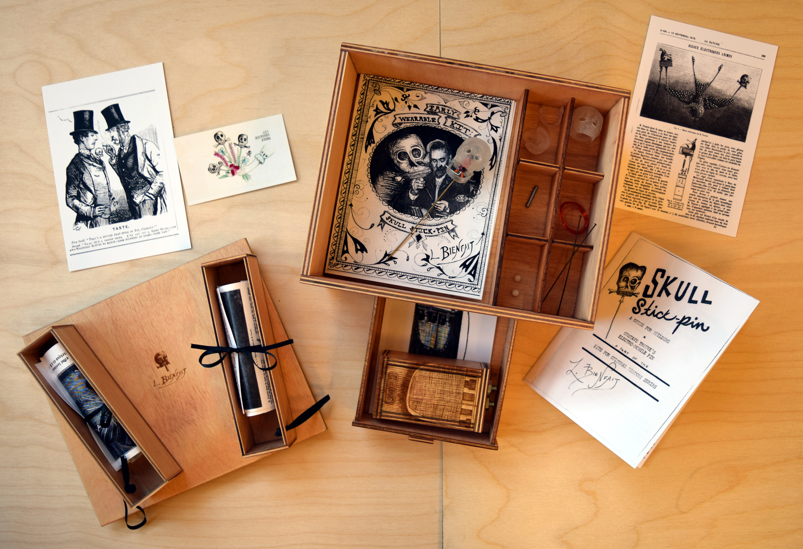

# Early Wearables Kit (2015) 

This repository is an "Early Wearables Kit" made by the Maker Lab in the Humanities (MLab) at the University of Victoria (http://maker.uvic.ca/). The Wearables Kit prompts people to reverse engineer and reassemble an electro-mobile skull stick-pin intended for cravats, designed by Gustave Trouvé, built by Auguste-Germain Cadet-Picard, and exhibited at the *Exposition universelle* in Paris in 1867. Powered by a 1.5-volt zinc-carbon battery in the wearer's pocket, the skull was said to snap its jaws and move its eyes. To activate the battery, the wearer would flip the pocket battery from a vertical to a horizontal position. Once activated, the battery would trigger a mechanism (resembling that of an electric bell) hidden inside the small skull. This combination of electricity with jewellery was not only unique for the 1860s. It also positions the stick-pin as an early wearable technology. 

To our knowledge, only one instance of this stick-pin exists in a memory institution today, at the Victoria and Albert Museum in London (see http://collections.vam.ac.uk/item/O115814/stick-pin-cadet-picard-auguste/). However, it cannot be accessed, and it is not accompanied by the original battery.

After significant research, including archival work and rapid prototyping experiments, the MLab wonders if the skull was ever fully automated or functioned consistently before or after the 1867 exposition. So we submit this repository to you for some conjectural history and manufacturing. 

The Early Wearables Kit includes 3-D models for the skull stick-pin, historical images for contextualizing it, a guide for interpreting it, instructions (starring Trouvé himself) for ways it may be assembled, and a box for storing, arranging, and circulating the Kit's components in tactile form. We have also included references for additional reading, photographs of the Kit as it's been exhibited, and abstracts for academic essays published by the MLab about the Kit.   

The Wearables Kit is part of a series of kits by the Maker Lab, and it was made with support from the Social Sciences and Humanities Research Council (SSHRC), the Canada Foundation for Innovation (CFI), and the British Columbia Knowledge Development Fund (BCKDF). 

## History 

The [history folder](/history) contains various historical images related to the electro-mobile skull stick-pin. These images include illustrations of the pin as well as illustrations of related designs by Trouvé. For the Kit, the MLab prints these images and places them in the bottom compartments of the box. Metadata for these images is forthcoming.  

## Skull 

The [skull folder](/skull) contains 3-D models for each component of the skull. For ease of fabrication, we have included both OBJ and STL files, which may be fed to CAD software or 3-D printers, milling machines, and routers. During our research, we prototyped the skull in acrylic, partly because of its translucence. (The original skull was made of gold and enamel with diamond sparks.) For the purposes of testing, acrylic is relatively durable. This folder also contains process documentation (JPG and PDF) exhibiting how the MLab prototyped the skull over time. One of first prototypes was hand-carved from basswood and then digitized using a structured-light, 3-D scanner. 

## Mechanism 

The [mechanism folder](/skull/mechanism) contains images detailing how the mechanism (resembling an interrupter bell or electric bell used as telegraph sounders) may have animated the jaw and eyes. From the MLab's perspective, the mechanism is the most complex component of the prototype. While it resembles an electric bell from the period, it is also much smaller. Materials, such as soft iron core, for these bells are not readily available today. As an alternative to the electric bell, the MLab also experimented with a solenoid. Images for these experiments are included in the folder, and video demonstrating the solenoid and telegraph sounder is available at https://vimeo.com/113746979. With these images, we have also include corelDRAW (CDR) files and photographs for making the pocket battery, which requires a 9-volt and wires. The mechanism folder also includes process documentation (in poster form) of how the MLab prototyped the skull and mechanism. 

## Box 

The [box folder](/box) contains corelDRAW (CDR) and Adobe Illustrator (AI) files for making a container in which to store, arrange, and circulate the Wearables Kit. This box can be etched with Gustave Trouvé's signature ("L. Bienfait"), and it contains dividers, compartments, and a drawer. For prototyping and circulation, the MLab used a laser cutter to make the box out of Baltic birch. Conceptually, the box is inspired by Fluxkits made during the 1960s, '70s, and '80s. Images of these prototypes are included in the folder, which also contains process documentation (in poster form) of how the MLab developed the box from sketch to tactile container.  

## Guide

The [guide folder](/guide) contains four versions of a guide for contextualizing, interpreting, and assembling the skull stick-pin. For viewing the individual pages of the illustrated guide, see the [pageImages](/guide/pagesImages) subfolder. For viewing the page spread of the guide, see the [pageSpreadView](/guide/pageSpreadView) subfolder. This view is best for reading the guide on screen, in PDF or JPG. To print the guide, see the [sheetsView](/guide/sheetsView) subfolder. The MLab prints the guide in black and white and then either stitches the pages together or fastens them with ribbon or string. Finally, for raw text, see the TXT files. The guide includes instructions for assembly; however, these instructions are meant to be somewhat conjectural, prompting audiences to question them or fill in the gaps (in part because the MLab cannot know for certain how the skull stick-pin was made). Inspired by present-day zines, the guide is also informed by grangerized books from the period. Specifically, it grangerizes George Barral's 1891 biography of Trouvé. The guide includes historical information and is structured by keywords for interpreting the stick-pin as an early wearable. Drawing on the work of Raymond Williams, these keywords are: "class," "electromagnets," "gender," "miniature," "mourning," "orientalism," and "performance." While these keywords give the stick-pin dimension as a cultural object, they also afford conflicting interpretations of it. The folder also includes process documentation (in poster form) of how the MLab prototyped the guide over time. 

## Essays 

The [essays folder](/essays) includes abstracts for journal articles containing material about the Early Wearables Kit in particular or the Kits for Cultural History project in general. "Kits for Cultural History, or Fluxkits for Scholarly Communication" (*Hyperrhiz*, Issue 13, 2015) outlines the relationship between the Kits and Fluxkits, with an emphasis on design and tacit knowledge. "Prototyping the Past" (*Visible Language*, forthcoming) details a method for prototyping media history and then unpacks the Early Wearables Kit as an example. This article contains significant historical information about the skull stick-pin, together with a theoretical framework for rapid prototyping in a media studies context. Finally, "Why Fabricate?" (*Scholarly and Research Communication*, Issue 6.3, 2015), offers four reasons why humanities practitioners may wish to fabricate tactile objects for their research. Where applicable, URLs for these essays are provided with the abstracts. 

## Exhibitions

The [exhibitions folder](/exhibitions) includes photographs of events where the MLab has shown the Early Wearable Kit, which was first displayed at Rutgers University in October 2015. 

## Technologies 

The Early Wearable Kit is a multiple made of wood, paper, ink, acrylic, wire, magnets, iron, steel, ribbon, nuts, bolts, mourning, lasers, trial, Myriad Pro, photographs, extra-illustration, error, CAD files, 9 volts, Internet, repetition, and calling cards. The object files in this repository can be fabricated using a laser cutter, 3-D printer, milling machine, or router. For software, the MLab recommends Rhino, CorelDRAW, and Adobe Illustrator. 

## People 

 Since 2013, the following researchers have contributed to the Early Wearables Kit: Nina Belojevic, Tiffany Chan, Nicole Clouston, Devon Elliott, Katherine Goertz, Shaun Macpherson, Kaitlynn McQueston, Danielle Morgan, Victoria Murawski, Jentery Sayers, and William J. Turkel. The Social Sciences and Humanities Research Council, the Canada Foundation for Innovation, and the British Columbia Knowledge Development Fund have supported this research. 

 ## Change Log 

 This is Version 1.0 of the Early Wearable Kit. All files for this version were updated on 6 Friday 2015.  

